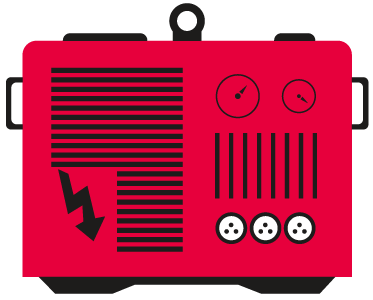

import { Head } from "mdx-deck";
import { Image } from 'mdx-deck'; 
import Code from "mdx-code";

import Grid from './components/grid'

<Head>
  <title>Async Iterators</title>
  <meta name='twitter:card' content='summary_large_image' />
  <meta name='twitter:site' content='@jxnblk' />
  <meta name='twitter:title' content="Why aren't you using Async Iterators? "/>
  <meta name='twitter:description' content="Node.js has native support for async generators and iterators in 10.0.0. Why aren't you using them yet?" />
  <meta name='twitter:image' content='https://example.com/card.png' />
</Head>

# Why aren't you using async generators
[@pranaygp](https://twitter.com/pranaygp)

---

<Image src="images/graphql.png" size="contain" />

```notes
Something I wanted to share
I've worked with Lee Byron, Yuzhi Zheng, and the rest of the GraphQL team
Very proud of this and the bright future for GraphQL

```

---
# What are async generators anyway?

---

<Image src='images/generators.svg' size='contain' />

```notes
A brand new concept in the power generation industry
But seriously, I will show you how they work and why
- they're clean
- and functional
- functional
- and useful
```

---

<Grid />

```notes
"arrays" is sort of wrong. In reality, "Iterators" fit in here
```

---

# Arrays

---
export default Code

```javascript Arrays
const arr = [1, 2, 3];
for (let x of arr) {
  console.log(x);
}
```

---
export default Code

```javascript
const arr = [1, 2, 3];
```
```javascript Arrays
[...arr];
```

---
export default Code

```
const arr = [1, 2, 3];
```
```javascript Arrays
[a, b, c] = arr;
a;
```

---

# "Arrays" are something "special"
🤔

---

# Iterators
The real basis for Arrays, maps, etc

---

# Let's make our own

---
export default Code

```javascript A custom iterator
let curr = 10;
const it = {
  [Symbol.iterator]: () => ({
    next() {
      return { value: curr--, done: curr < 0 }
    }
  })
}
```

---
export default Code

```javascript
let curr = 10;
const it = {
  [Symbol.iterator]: () => ({
    next() {
      return { value: curr--, done: curr < 0 }
    }
  }),
}
```
```javascript for loop
for (let x of it) {
  console.log(x)
}
```

---
export default Code

```javascript
let curr = 10;
const it = {
  [Symbol.iterator]: () => ({
    next() {
      return { value: curr--, done: curr < 0 }
    }
  }),
}
```
```javascript spreads
[...it];
```

---
export default Code

```javascript
let curr = 10;
const it = {
  [Symbol.iterator]: () => ({
    next() {
      return { value: curr--, done: curr < 0 }
    }
  }),
}
```
```javascript destructuring
const [a, b, c] = it;
a;
```

---

# Cool.

```notes
That's cool, but why would I wanna make my own iterators?
```

---
export default Code

```javascript lazy
let curr = 10;
const it = {
  [Symbol.iterator]: () => ({
    next() {
      console.log("A value was calculated");
      return { value: curr--, done: curr < 0 }
    }
  }),
}
const [a, b, c] = it;
a;
```

---
export default Code

```javascript infinite lists 🤯
let curr = 1;
const it = {
  [Symbol.iterator]: () => ({
    next() {
      return { value: curr++, done: false }
    }
  }),
}
const [a, b, c] = it;
a;
```

---
# Cool.

---
# I hate the syntax

---


---
export default Code

```javascript Generators
function* g() {
  for(let i = 1; true; i++) {
    yield i;
  }
}
const [a, b, c, d, e, f, _, h, i, j, k] = g();
k;
```

---

# But Pranay
You promised us something useful.

```notes
No I didn't. 
There are some useful things you can do with iterators.
redfine map, reduce, filter, etc.
make lazy, efficient lists and reduce memory usage
beautiful code 😍
```

---

# Async Iterators

---

export default Code

```
const sleep = ms => new Promise(r => setTimeout(r, ms));
```
```javascript sleepy lists 😴
let curr = 10;
const it = {
  [Symbol.asyncIterator]: () => ({
    next: async () => {
      await sleep(1000);
      return { value: curr--, done: curr < 0 }
    }
  }),
}
```

---
export default Code

```javascript
const sleep = ms => new Promise(r => setTimeout(r, ms));
let curr = 10;
const it = {
  [Symbol.asyncIterator]: () => ({
    next: async () => {
      await sleep(1000);
      return { value: curr--, done: curr < 0 }
    }
  }),
}
```
```javascript for loop
;(async () => {
  for await (let x of it) {
    console.log(`${Date.now()} - ${x}`);
  }
})();
```

---
# Okay, now that's cool.

---
# But wait
There's more

---
export default Code

```javascript
const sleep = ms => new Promise(r => setTimeout(r, ms));
```
```javascript async + generators 🤯
async function* f() {
  for(let i = 1; true; i++) {
    await sleep(1000);
    yield i;
  }
}
;(async () => {
  for await (let x of f()) {
    console.log(`${Date.now()} - ${x}`);
  }
})();
```

---
# 🤮

```notes
It's redundant
using `for` loops; not really functional
```

---

# Polling

---
export default Code

```javascript
const fetch = require('node-fetch');
const isssPosition = () => fetch('http://api.open-notify.org/iss-now.json').then(r => r.json()).then(({iss_position}) => iss_position)
const sleep = ms => new Promise(r => setTimeout(r, ms))
const distance = (a, b) => Math.sqrt((b.latitude-a.latitude)**2 + (b.longitude - a.longitude)**2)
```

```javascript Polling
async function* trackISS () {
    while (true) {
        const now = await isssPosition();
        yield now;
        await sleep(2000);
    }
}

;(async () => {
    for await (let d of trackISS()) {
        console.log(d);
    }
})();
```

---
# Cool.
But you said it'd be functional 🤔

---
export default Code

```javascript infinite
async function* infinite() {
  while (true) {
    yield;
  }
}
```

---
export default Code

```javascript map
async function* map(f, it) {
  for await (const v of it) {
    yield f(v)
  }
}
```

---
export default Code

```javascript
const sleep = ms => new Promise(r => setTimeout(r, ms))
```
```javascript delay
async function* delay(ms, it) {
  for await (const v of it) {
    await sleep(ms);
    yield v;
  }
}
```

---
export default Code

```javascript
const fetch = require('node-fetch');
const issPosition = () => fetch('http://api.open-notify.org/iss-now.json').then(r => r.json()).then(({iss_position}) => iss_position)
const sleep = ms => new Promise(r => setTimeout(r, ms))
const distance = (a, b) => Math.sqrt((b.latitude-a.latitude)**2 + (b.longitude - a.longitude)**2)
async function* infinite() {
  while (true) {
    yield;
  }
}
async function* map(f, it) {
  for await (const v of it) {
    yield f(v)
  }
}
async function* delay(ms, it) {
  for await (const v of it) {
    await sleep(ms);
    yield v;
  }
}
async function* take(n, it) {
    let done = false;
    let value;
    while (n > 0 && !done) {
        n--;
        ;({value, done} = await it.next());
        yield value;
    }
}
async function* pairwise(it) {
  let prev;
  for await (const v of it) {
    if (prev) {
      yield [prev, v];
    }
    prev = v;
  }
}
```
```javascript functional polling
// Live demo time!
```

---
export default Code

```javascript shiksha
const fetch = require('node-fetch');
const issPosition = () => fetch('http://api.open-notify.org/iss-now.json').then(r => r.json()).then(({iss_position}) => iss_position)

const { consume, take, map, delay, infinite } = require('shiksha');

await consume(take(5, map(issPosition, delay(1000, infinite()))))
```

---
# Pranay
Can I hire you?

---
# No

---
# [@pranaygp](https://twitter.com/pranaygp)
But you can follow me 😉

---
# 👋
slides @ [granular.pranay.gp](https://granular.pranay.gp)